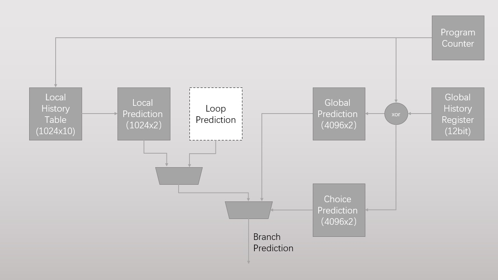

# 毕业设计文档

 ___

## 整体架构

整体灵感来源于经典超标量处理器Aloha 21264，将其基于局部历史的分支预测中使用的3位饱和计数器替换为2位饱和计数器(对性能的影响待测试)，再在基于局部历史的分支预测中加入与循环预测器的竞争。此部分目前还是设想，具体实现待定。整体预想架构如下图所示。

## 规划

* 使用verilator结合make来自动化执行分支预测器仿真测试
* 在基础版本后持续改进以及做对照版本，放在分支里，然后都可以测，都可以比较

## 进度log

* 2023.2.23 初建仓库，目前正在完成两位饱和计数器更新逻辑
* 2023.2.24 考虑到其实只需要一个饱和计数器更新模块，因为同时最多只有一个饱和计数器的值在更新，所以调整思路做了Local Prediction的骨架，计划但暂未接入饱和计数器值更新逻辑，测试了饱和计数器值更新模块(CounterNextValueGenerator)的功能，确保功能正确
* 2023.2.25 在Local Prediction内例化接通了饱和计数器下一值生成模块，重新考虑了Local Prediction的io设计，为了减少饱和计数器堆的读取端口数量决定将指令预测的Counter值跟着指令走，减少后续值更新时对Counter的二次访问，计划测试功能
